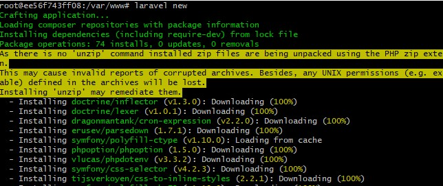

#Laravel Basics
##Installing Laravel

###Via Laravel Installer
	composer global require laravel/installer
Make sure you already have composer installed, if not, you can get it here: https://getcomposer.org/

Then you can install using,
```
laravel new
```


###Via Composer Create-Project
	composer create-project --prefer-dist laravel/laravel PROJECT_NAME "5.8.*"

and run the project by,
```
php artisan serve
```

Go to http://localhost and verify that you see the following page.


##Folder Structure
Laravel 5.8.2 folder structure is shown below.


##Database configuration
You can update database configurations in .env file. This time, i'll be using the configuration below.


##Checking available commands that can be used with Laravel
Since Laravel commands are slightly different depending on the version, let's confirm the command beforehand. 
Laravel has a command that list available commands and also see how to use the arguments.
```
php artisan
php artisan list
```


##Create model and migration
When creating a model, you can
```
php artisan make:model Review 
```
which create a model file. Adding -m option will create a migration file related to the model at the same time.
```
php artisan make:model Review -m
```
Review model


and
migration file,


Edit the migration file and add columns
```
$table->string('title');
$table->text('body');
```


Run migration command so that modifications will be reflected in the database
```
php artisan migrate
```

##Make a Controller
###Creating a web controller
The controller creation command is 
```
php artisan make:controller Reviews
```
There is a contract that the controller must be defined in plural form.

In this case, -r option is added to generate a controller that automatically defines Resourceful actions.
```
php artisan make:controller ReviewsController -r
```

##Creating API controller
```
php artisan make:controller API/ReviewsController --api
```


##Define routing
Since we have defined Resourceful actions in the creation of controllers we will also define Resourceful routing in routing.

In routes directory, the following four files are stored.
```
api.php
channels.php
console.php
web.php
```

If you want to create a web application, you will be using the web.php for routing. Otherwise, if it is an api, you will be using api.php.
######Note: We will be using the api for this guide.

Add routes in api
```
Route::apiResource('reviews', 'API\ReviewsController');
```

To check list of routes available in our project, we can invoke the command,
```
php artisan route:list
```


##Update methods in API controller
We need to update our controller methods to return correct data when called.

Modify index(),


Modify store(),


Modify show(),


Modify update(),


and modify destroy(),


##Inserting dummy data using seeder
Up to this point, we already have our model, controller and routes ready. In order to check if these works fine, let's put dummy data in it.

Adding dummy data in Laravel is easy, we can do that by creating a seeder file,
```
php artisan make:seeder ReviewsTableSeeder
```


After running the command above, ReviewsTableSeeder.php file is created under database/seeds.
We will edit the file and put initial data.

After editing ReviewsTableSeeder we need to call it inside the run() function of database/seeds/DatabaseSeeder.php by adding,
```
$this->call(ReviewsTableSeeder::class);
```


Then, we need to run
```
php artisan db:seed 
```
so that seed data will be inserted in our database.


To check whether the test data has entered. At the terminal, do the following:
```
php artisan tinker
```


##Create New Review
I used postman, https://www.getpostman.com/ for sending requests to the api.

###Creating a new review with the API.

Start Postman, and select POST with url http://localhost/api/reviews. 
Go to tab menu and select Body and fill up form-data. Click Send.

| Key | Value |
| ------ | ------ |
| title | Test 1 |
| body | Test Content |

###Confirm list
To check the list, change the HTTP method to GET and url to http://localhost/api/reviews and click Send in the upper right.


###Get a specific id
To retrieve only a specific id, go to http://localhost/api/reviews/{id}. In this case, let's retrieve Review 1.


###Update specific id information
To update a review, change the method to PATCH and changed to Body->x-www-form-urlencoded tab.
Use the url http://localhost/api/reviews/{id}, and fill up the new key value.

| Key | Value |
| ------ | ------ |
| title | Updated Title |
| body | Updated content |


###Deleting records
You can delete an item using the DELETE method and URL http://localhost/api/reviews/{id} and click Send


